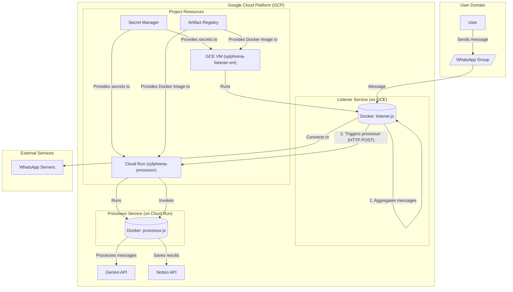

# Sylphrena

Sylphrena is a WhatsApp bot designed to streamline communication in school-related group chats. It listens for messages, uses Google's Gemini AI to identify tasks, homework, or tests, and automatically creates corresponding entries in a Notion database.

## Architecture

The application is split into two main services to optimize for both cost and functionality:

*   **Listener (Google Compute Engine - GCE)**: A long-running `e2-micro` VM (within the GCP free tier) that runs the `whatsapp-web.js` client. This service maintains a persistent WhatsApp session, captures messages from authorized groups, and batches them for processing.
*   **Processor (Google Cloud Run)**: A serverless, scalable service that receives batched messages from the Listener. It uses the Gemini API to process the text and the Notion API to create database entries. This service only runs when it receives a request, making it highly cost-effective and likely to remain within the GCP free tier.

This decoupled architecture ensures the stateful, long-running WhatsApp connection is handled by a persistent, free VM, while the stateless, intensive processing work is handled by a scalable, on-demand serverless service.

### Architecture Diagram



## Prerequisites

Before you begin, ensure you have the following tools installed and configured:
*   Node.js (v18 or later)
*   Docker
*   Terraform
*   Google Cloud SDK (`gcloud`)

## Project Setup

1.  **Clone the repository:**
    ```bash
    git clone <your-repository-url>
    cd Sylphrena
    ```

2.  **Install dependencies:**
    ```bash
    npm install
    ```

3.  **Configure Local Environment:**
    Create a `.env` file in the project root for local development. You can copy the example file to start.
    ```bash
    cp .env.example .env
    ```
    Fill in the required secret values in your new `.env` file.

4.  **Configure Cloud Environment:**
    Create a `terraform.tfvars` file inside the `terraform/` directory for your cloud deployment.
    ```bash
    cp terraform/terraform.tfvars.example terraform/terraform.tfvars
    ```
    Fill in the required secret values in `terraform/terraform.tfvars`.

## Onboarding a New User/Group

Onboarding a new user involves authorizing their WhatsApp group so the listener can capture messages from it. This is done by adding the group's unique ID to a secure list.

**The Challenge: Finding the Group ID**

The system is designed for security and privacy, meaning it intentionally ignores any groups that are not on the authorized list. A side effect is that it does not log the ID of new, unknown groups it is added to. Therefore, getting the Group ID for a new group requires a temporary, manual process.

**Prerequisites:**
*   You must have `gcloud` installed and authenticated with permissions to access Google Secret Manager.
*   The Sylphrena listener bot must be added to the target WhatsApp group before you begin.

**Steps to Onboard:**

1.  **Get the Group ID:**
    The most reliable way to get the Group ID is to temporarily modify the code to log it.
    *   **Edit `listener.js`**: Open the `listener.js` file.
    *   **Add a log statement**: Find the line `const trueGroupId = chat.id._serialized;`. Immediately after it, add the following line:
        ```javascript
        console.log(`INFO: Message received from Group ID: ${trueGroupId}`);
        ```
    *   **Deploy the change**: Follow the "Updating the Listener (GCE)" steps below to deploy this temporary change. This will involve building and pushing a new tagged image and recreating the VM.

2.  **Find and Copy the Group ID:**
    *   After the updated listener is running, send a message in the new WhatsApp group you want to authorize.
    *   SSH into the `sylphrena-listener-vm` in GCP and view the Docker logs:
        ```bash
        sudo docker logs sylphrena-listener
        ```
    *   Look for the log line you added: `INFO: Message received from Group ID: ...`. 
    *   The ID will look something like `1234567890@g.us`. Copy this entire ID.

3.  **Update the Secret in Secret Manager:**
    *   The list of authorized groups is a comma-separated string stored in Google Secret Manager.
    *   First, get the current list of authorized groups:
        ```bash
        gcloud secrets versions access latest --secret="authorized-groups"
        ```
    *   This will return the current list. Copy it.
    *   Append your new Group ID to this string, separated by a comma. For example: `id1@g.us,id2@g.us,newly-found-id@g.us`.
    *   Create a new temporary file (e.g., `new_secrets.txt`) and paste the complete, updated comma-separated list into it.
    *   Update the secret with the new list:
        ```bash
        gcloud secrets versions add authorized-groups --data-file="new_secrets.txt"
        ```
    *   Delete the temporary `new_secrets.txt` file.

4.  **Restart the Listener VM:**
    *   From the GCP Console, navigate to Compute Engine and restart the `sylphrena-listener-vm` instance. 
    *   The VM's startup script will automatically fetch the newly updated secret, and the bot will now be authorized to listen in the new group.

5.  **Cleanup:**
    *   **Important**: Remove the temporary `console.log` statement from `listener.js`.
    *   Re-deploy the listener by following the update process again. This keeps the production logs clean and focused on important events.

## Local Development

You can run the entire application stack locally using Docker Compose.

1.  **Start the services:**
    ```bash
    docker-compose up --build
    ```
2.  **Authenticate WhatsApp:**
    Scan the QR code printed in the terminal to link the bot to your WhatsApp account.

## Deployment to Google Cloud

The deployment is a multi-stage process to correctly handle the dependency between the cloud services and the Docker image.

### Step 1: Authenticate with GCP

Ensure your local environment is authenticated to manage GCP resources.
```bash
gcloud auth application-default login
```

### Step 2: Deploy Infrastructure (Stage 1 - Repository)

This stage creates only the Google Artifact Registry (GAR) repository, so you have a place to push your image.

1.  Navigate to the Terraform directory:
    ```bash
    cd terraform/
    ```
2.  Initialize Terraform:
    ```bash
    terraform init
    ```
3.  Apply the target to create the repository:
    ```bash
    terraform apply -target=google_artifact_registry_repository.sylphrena_repo
    ```
    Review the plan and type `yes` when prompted.

### Step 3: Build and Push the Docker Image

Now that the repository exists, you can build and push your application's container image.

1.  Navigate to the project root directory:
    ```bash
    cd ..
    ```
2.  Authenticate Docker with GAR:
    ```bash
    gcloud auth configure-docker us-central1-docker.pkg.dev
    ```
3.  Build, Tag, and Push the Image (replace `<YOUR_GCP_PROJECT_ID>` with your actual GCP Project ID):
    ```bash
    # Build the image
    docker build -f docker/Dockerfile -t sylphrena_bot .

    # Tag the image for Artifact Registry
    docker tag sylphrena_bot us-central1-docker.pkg.dev/<YOUR_GCP_PROJECT_ID>/sylphrena-repo/sylphrena:v1.0.0

    # Push the image
    docker push us-central1-docker.pkg.dev/<YOUR_GCP_PROJECT_ID>/sylphrena-repo/sylphrena:v1.0.0
    ```

### Step 4: Deploy Infrastructure (Stage 2 - All Services)

With the image now available in the registry, you can deploy the rest of your services.

1.  Navigate back to the Terraform directory:
    ```bash
    cd terraform/
    ```
2.  Apply the full configuration:
    ```bash
    terraform apply
    ```
    Terraform will detect that the repository already exists and will proceed to create the GCE instance and Cloud Run service. Type `yes` when prompted.
    *(Note: The GCE instance will now use a `startup-script` to install Docker and run your container, replacing the deprecated `gce-container-declaration` method.)*

### Step 5: Verify GCE Instance Startup

The GCE instance will automatically execute its `startup-script` upon creation or restart. This script installs Docker, pulls your image, and starts the `sylphrena-listener-vm` container.

You can monitor the startup process by viewing the serial console output or SSHing into the VM.

1.  **Connect to the VM**:
    On the Compute Engine instances list, click the **SSH** button next to `sylphrena-listener-vm`.

2.  **Check Docker status and container logs**:
    Once connected, you can verify Docker is running and check the container logs:
    ```bash
    sudo systemctl status docker
    sudo docker ps -a
    sudo docker logs -f sylphrena-listener-vm
    ```
    Wait for the `🛡️ Sylphrena Listener is ready.` message.

### Step 6: Final WhatsApp Authentication

The final step is to link your running bot to your WhatsApp account.
1.  **View Logs and Scan QR Code**:
    In the SSH terminal you opened in the previous step, view the container's logs to find the QR code.
    ```bash
    # Find the container ID
    docker ps

    # Follow the logs (replace <your_container_id>)
    docker logs -f <your_container_id>
    ```
    Scan the QR code printed in the terminal with the WhatsApp app on your phone. Once you see the `🛡️ Sylphrena Listener is ready.` message, the bot is fully deployed.

## Updating the Services

### Updating the Processor (Cloud Run)

The Cloud Run service is configured to use a versioned Docker image tag (e.g., `v1.0.1`). To update the processor:
1.  Update the `docker_image_tag` in your `terraform/terraform.tfvars` file to a new version (e.g., `v1.0.2`).
2.  Build and push the new Docker image with the corresponding tag.
3.  Run `terraform apply`. Terraform will detect the change in the image tag and deploy a new revision of the Cloud Run service automatically.

### Updating the Listener (GCE)

The GCE instance only runs its startup script on creation. To apply an updated Docker image, you must force the VM to be recreated.

1.  **Build and Push the new Docker image** with a new version tag (e.g., `v1.0.11`).
2.  **Update the `docker_image_tag`** in your `terraform/terraform.tfvars` file to match the new version.
3.  **Taint the GCE instance resource**. This marks the VM for destruction and recreation on the next apply.
    ```bash
    cd terraform/
    terraform taint google_compute_instance.sylphrena_listener_vm
    ```
4.  **Apply the changes**. Terraform will now plan to replace the VM. Type `yes` to approve.
    ```bash
    terraform apply
    ```
5.  **Re-authenticate WhatsApp** by following Step 6 of the deployment instructions, as the VM was recreated.

## Terraform Management

From within the `terraform/` directory:

*   **Plan changes**: `terraform plan`
*   **Apply changes**: `terraform apply`
*   **Destroy all resources**: `terraform destroy`