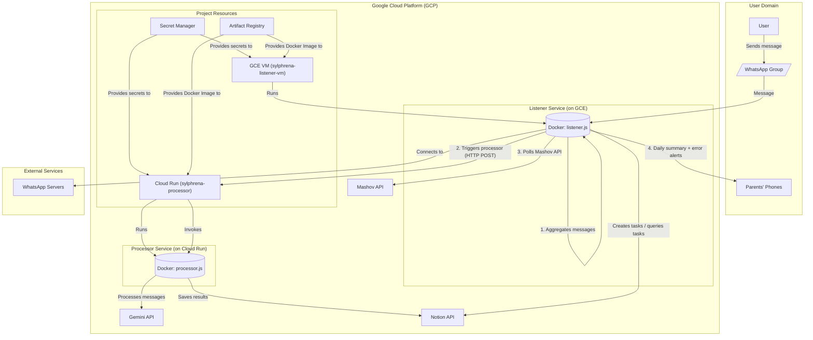

# Sylphrena

Sylphrena is a WhatsApp bot designed to streamline communication in school-related group chats. It listens for messages, uses Google's Gemini AI to identify tasks, homework, or tests, and automatically creates corresponding entries in a Notion database.

## Architecture

The application is split into two main services to optimize for both cost and functionality:

*   **Listener (Google Compute Engine - GCE)**: A long-running `e2-micro` VM (within the GCP free tier) that runs the `whatsapp-web.js` client. This service maintains a persistent WhatsApp session, captures messages from authorized groups, aggregates them over a 10-minute window, and sends batched messages to the Processor.
*   **Processor (Google Cloud Run)**: A serverless, scalable service that receives batched messages from the Listener. It uses the Gemini API to process the text and the Notion API to create database entries. This service only runs when it receives a request, making it highly cost-effective and likely to remain within the GCP free tier.
*   **Mashov Integration**: The listener polls the Mashov school portal API on a configurable interval, fetching homework assignments and Moodle tasks for tracked students. New items are deduplicated and sent to Notion automatically.
*   **WhatsApp Notifications**: The bot sends a daily summary of upcoming tasks (next 7 days, excluding completed) to configured phone numbers at 18:00 Israel time. Error alerts (e.g., Mashov poll failures) are sent to an admin number, throttled to max 1 per hour.

This decoupled architecture ensures the stateful, long-running WhatsApp connection is handled by a persistent, free VM, while the stateless, intensive processing work is handled by a scalable, on-demand serverless service.

### Architecture Diagram



## Prerequisites

Before you begin, ensure you have the following tools installed and configured:
*   Node.js (v18 or later)
*   Docker
*   Terraform
*   Google Cloud SDK (`gcloud`)

## Project Setup

1.  **Clone the repository:**
    ```bash
    git clone <your-repository-url>
    cd Sylphrena
    ```

2.  **Install dependencies:**
    ```bash
    npm install
    ```

3.  **Configure Local Environment:**
    Create a `.env` file in the project root for local development. You can copy the example file to start.
    ```bash
    cp .env.example .env
    ```
    Fill in the required secret values in your new `.env` file.

4.  **Configure Cloud Environment:**
    Create a `terraform.tfvars` file inside the `terraform/` directory for your cloud deployment.
    ```bash
    cp terraform/terraform.tfvars.example terraform/terraform.tfvars
    ```
    Fill in the required secret values in `terraform/terraform.tfvars`.

## CLI Management Tools

Sylphrena includes local CLI tools for managing the bot without needing to SSH into the VM or manually edit secrets. All commands require `gcloud` CLI installed and authenticated.

**Prerequisites for all commands:**
*   `gcloud` CLI installed and authenticated (`gcloud auth login`)
*   GCP project configured (`gcloud config set project <PROJECT_ID>`)

### Quick Reference

| Command | Purpose |
|---------|---------|
| `npm run onboard` | Add or remove authorized WhatsApp groups |
| `npm run scan` | Stream VM logs to scan a QR code |
| `npm run signout` | Sign out the current WhatsApp account on the VM |

---

### `npm run onboard` — Manage Authorized Groups

Connects to WhatsApp locally to fetch your group list, then lets you add or remove groups from the authorized list in GCP Secret Manager.

**Additional prerequisite:** The bot's WhatsApp account must be added to the target group(s) first.

**What it does:**
1.  Checks your `gcloud` authentication and project configuration
2.  Fetches the currently authorized groups from GCP Secret Manager
3.  Connects to WhatsApp (you scan a QR code on first run only)
4.  Opens a searchable group list in your browser (with proper Hebrew support)
5.  Lets you choose to **(a)dd** groups, **(r)emove** groups, or **(q)uit**
6.  Updates GCP Secret Manager with your changes
7.  Optionally restarts the GCE listener VM to pick up the changes

**Example — adding groups:**
```
What would you like to do? (a)dd groups, (r)emove groups, (q)uit: a

Groups available to add:

    1. (972534567890-1234567890@g.us) Science Class
    2. (972545678901-9876543210@g.us) English Group

Enter group numbers to add (comma-separated, e.g. 1,3), "all", or "b" to go back: 1,2

Groups to add (2):
  + (972534567890-1234567890@g.us) Science Class
  + (972545678901-9876543210@g.us) English Group
Total authorized after update: 3

Update Secret Manager? (y/n): y
Secret Manager updated successfully.
```

**Example — removing groups:**
```
What would you like to do? (a)dd groups, (r)emove groups, (q)uit: r

Currently authorized groups:

    1. (972522949046-1533827556@g.us) Math Homework
    2. (972534567890-1234567890@g.us) Science Class

Enter group numbers to remove (comma-separated, e.g. 1,3), or "b" to go back: 2

Groups to remove (1):
  - (972534567890-1234567890@g.us) Science Class
Total authorized after update: 1

Update Secret Manager? (y/n): y
Secret Manager updated successfully.
```

**Notes:**
*   Uses a separate WhatsApp session (`.wwebjs_onboard/`) — never interferes with the production bot.
*   After the first QR scan, subsequent runs reuse the saved session (no QR needed).

---

### `npm run scan` — Stream VM Logs for QR Code

Streams the listener VM's Docker logs to your terminal so you can scan the WhatsApp QR code. Use this after a deployment or VM restart to authenticate the bot.

**Example:**
```
VM name [sylphrena-listener-vm]:
Zone [us-central1-a]:
Restart the VM first? (y/n) [n]: n

Streaming VM logs — scan the QR code with WhatsApp.

[QR code appears here]

Listener is ready — disconnecting from logs.
```

The script auto-exits once it detects "Sylphrena Listener is ready" in the logs.

---

### `npm run signout` — Sign Out WhatsApp Account

Signs out the current WhatsApp account from **both** the local onboard tool and the VM listener. Use this when switching to a different WhatsApp user (e.g., a different family member).

**Example:**
```
VM name [sylphrena-listener-vm]:
Zone [us-central1-a]:
This will sign out the current WhatsApp account everywhere.
You will need to scan QR codes with the new account afterward.
Continue? (y/n): y

Clearing local session...
  Local session cleared.
Clearing VM session...
  VM session cleared and container restarting.

Both sessions have been signed out.
To set up a new user:
  1. npm run scan     — scan QR with the new WhatsApp account (VM bot)
  2. npm run onboard  — scan QR again to manage groups (local tool)
```

**Typical flow to switch to a new user:**
1.  `npm run signout` — clear both local and VM sessions
2.  `npm run scan` — scan QR with the new WhatsApp account to link the VM bot
3.  `npm run onboard` — scan QR again to manage which groups are authorized

## Mashov Integration

The listener polls the [Mashov](https://web.mashov.info) school portal to automatically fetch homework and Moodle assignments. Configure via environment variables:

| Variable | Description |
|----------|-------------|
| `MASHOV_USERNAME` | Parent's Mashov username (enables polling when set) |
| `MASHOV_PASSWORD` | Parent's Mashov password |
| `MASHOV_SCHOOL_SEMEL` | School identifier number |
| `MASHOV_YEAR` | School year (e.g., `2025`) |
| `MASHOV_CHILD_FILTER` | Optional — filter by child's first name |
| `MASHOV_CHECK_INTERVAL_MS` | Poll interval in ms (default: `1800000` / 30 min) |

New homework and Moodle assignments are deduplicated (tracked in `mashov_processed.json`) and created as Notion tasks with source `Mashov` or `Mashov-Moodle`.

## WhatsApp Notifications

The bot sends notifications via WhatsApp using the existing session (no extra QR scan needed).

### Daily Summary
- Sent at **18:00 Israel time** (Asia/Jerusalem) to configured phone numbers
- Lists all incomplete tasks due in the next 7 days, grouped by date
- If no tasks are upcoming, sends "no upcoming tasks" message instead of skipping

### Error Alerts
- Sent when Mashov polling fails
- Throttled to **max 1 per hour** to avoid spam
- Sent to admin phone number only

Phone numbers and notification settings are configured in `notify.js`.

## Local Development

You can run the entire application stack locally using Docker Compose.

1.  **Start the services:**
    ```bash
    docker-compose up --build
    ```
2.  **Authenticate WhatsApp:**
    Scan the QR code printed in the terminal to link the bot to your WhatsApp account.

## Deployment to Google Cloud

The deployment is a multi-stage process to correctly handle the dependency between the cloud services and the Docker image.

### Step 1: Authenticate with GCP

Ensure your local environment is authenticated to manage GCP resources.
```bash
gcloud auth application-default login
```

### Step 2: Deploy Infrastructure (Stage 1 - Repository)

This stage creates only the Google Artifact Registry (GAR) repository, so you have a place to push your image.

1.  Navigate to the Terraform directory:
    ```bash
    cd terraform/
    ```
2.  Initialize Terraform:
    ```bash
    terraform init
    ```
3.  Apply the target to create the repository:
    ```bash
    terraform apply -target=google_artifact_registry_repository.sylphrena_repo
    ```
    Review the plan and type `yes` when prompted.

### Step 3: Build and Push the Docker Image

Now that the repository exists, you can build and push your application's container image.

1.  Navigate to the project root directory:
    ```bash
    cd ..
    ```
2.  Authenticate Docker with GAR:
    ```bash
    gcloud auth configure-docker us-central1-docker.pkg.dev
    ```
3.  Build, Tag, and Push the Image (replace `<YOUR_GCP_PROJECT_ID>` with your actual GCP Project ID):
    ```bash
    # Build the image
    docker build -f docker/Dockerfile -t sylphrena_bot .

    # Tag the image for Artifact Registry
    docker tag sylphrena_bot us-central1-docker.pkg.dev/<YOUR_GCP_PROJECT_ID>/sylphrena-repo/sylphrena:v1.0.0

    # Push the image
    docker push us-central1-docker.pkg.dev/<YOUR_GCP_PROJECT_ID>/sylphrena-repo/sylphrena:v1.0.0
    ```

### Step 4: Deploy Infrastructure (Stage 2 - All Services)

With the image now available in the registry, you can deploy the rest of your services.

1.  Navigate back to the Terraform directory:
    ```bash
    cd terraform/
    ```
2.  Apply the full configuration:
    ```bash
    terraform apply
    ```
    Terraform will detect that the repository already exists and will proceed to create the GCE instance and Cloud Run service. Type `yes` when prompted.
    *(Note: The GCE instance will now use a `startup-script` to install Docker and run your container, replacing the deprecated `gce-container-declaration` method.)*

### Step 5: Authenticate WhatsApp

After the VM is created, link the bot to your WhatsApp account:

```bash
npm run scan
```

This streams the VM's Docker logs to your terminal. Scan the QR code with your WhatsApp app (Linked Devices > Link a Device). The script auto-exits once the bot is ready.

## Updating the Services

### `deploy_sylphrena` — Deploy Updates

The `deploy_sylphrena` shell function handles the full deployment pipeline. It builds the Docker image, pushes it to Artifact Registry, updates Cloud Run via Terraform, and hot-swaps the container on the GCE VM — all while **preserving the WhatsApp session** (no QR re-scan needed).

**Setup:**
```bash
source deploy_sylphrena.sh
```
Or add `source /path/to/deploy_sylphrena.sh` to your `~/.zshrc` or `~/.bash_profile`.

**Usage:**
```bash
deploy_sylphrena
```

**What it does:**
1.  Builds the Docker image locally
2.  Auto-increments the version (stored in `~/.sylphrena_version`)
3.  Tags and pushes the image to Artifact Registry
4.  Runs `terraform apply` to update the Cloud Run processor
5.  SSHs into the GCE VM and hot-swaps the container in-place:
    - Pulls the new image
    - Saves environment variables from the running container
    - Stops and removes the old container
    - Starts a new container with the same env vars and volume mount
6.  The WhatsApp session persists on the VM's disk across deploys

After deploying, you can verify the listener is healthy with `npm run scan`.

## Terraform Management

From within the `terraform/` directory:

*   **Plan changes**: `terraform plan`
*   **Apply changes**: `terraform apply`
*   **Destroy all resources**: `terraform destroy`